[TOC]

# 腾讯IOT 安卓开发初探

> 目的：将Andorid端作为一个物联网设备（device），然后将其安卓设备上面的数据发送到腾讯云IOT开发平台上。（这里我们将手机上面的GPS经纬度发送到**腾讯云IOT**平台上）。

腾讯IOT开发平台：[https://console.cloud.tencent.com/iotexplorer](https://console.cloud.tencent.com/iotexplorer)

腾讯IOT Java SDK GitHub：[https://github.com/tencentyun/iot-device-java](https://github.com/tencentyun/iot-device-java)

开发工具：Android Studio

代码Github：[android_test_iot_for_tecent](https://github.com/xiaohuiduan/android_test_iot_for_tecent)


## Tecent IOT 开发平台的使用

开发平台的官方参考文档网址：[https://cloud.tencent.com/document/product/1081](https://cloud.tencent.com/document/product/1081)，不过个人觉得其文档对于Java SDK的描述不够详细，需要去看其 [Demo ](https://github.com/tencentyun/iot-device-java/tree/master/explorer/explorer-device-android)源码才能明白其工作流程。

腾讯云IOT开发平台的项目结构如下所示：分为两层——`项目` 和 `产品`。用在使用其平台的时候，既需要创建project，也需要创建product。

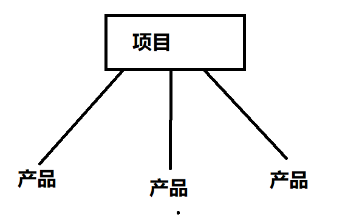

> 我们可以将**项目**理解为智能家居整个系统，因此在项目中有很多**产品**，比如说智能空调，智能报警器等等产品。


### 新建项目

新建项目，项目名称随意就行，创建好项目后，进入项目，然后创建产品。

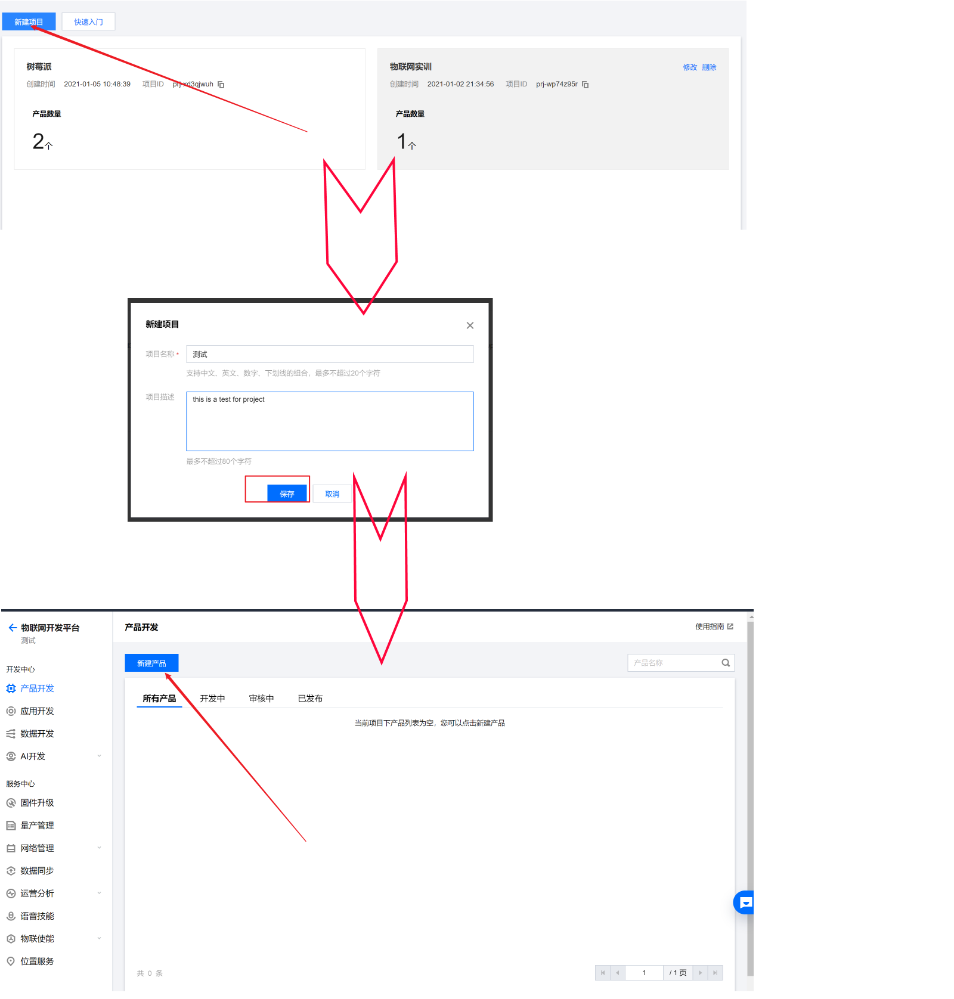

### 创建产品

创建产品的选项如下：

- 设备：因为我们是准备将安卓终端作为一台设备来使用的，因此，我们应该选择**”设备“**，当然，如果我们是准备将它作为网关，则看着选就行了。
- 认证方式：认证方式选择密钥认证，这样在代码中间直接写设备的密码就行，比证书稍微方便一点（不过实际上证书方便一点）。
- 数据协议：使用数据模板即可。

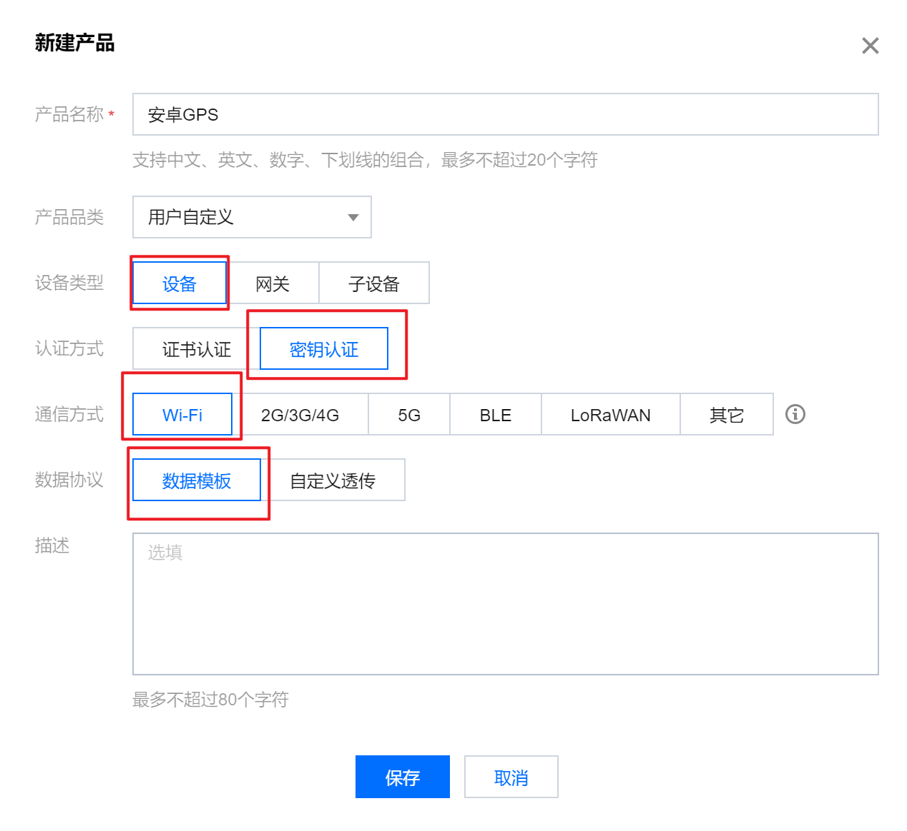

### 添加自定义功能

物联网设备，之所以叫物联网，是因为大家想把传感器获得的数据放在云端，或者通过云端去控制物联网设备。那么放什么数据，控制什么功能，则需要我们去定义。在腾讯IOT中，可以使用`新建功能`定义这些功能。

点击进入产品，选择**新建功能**。

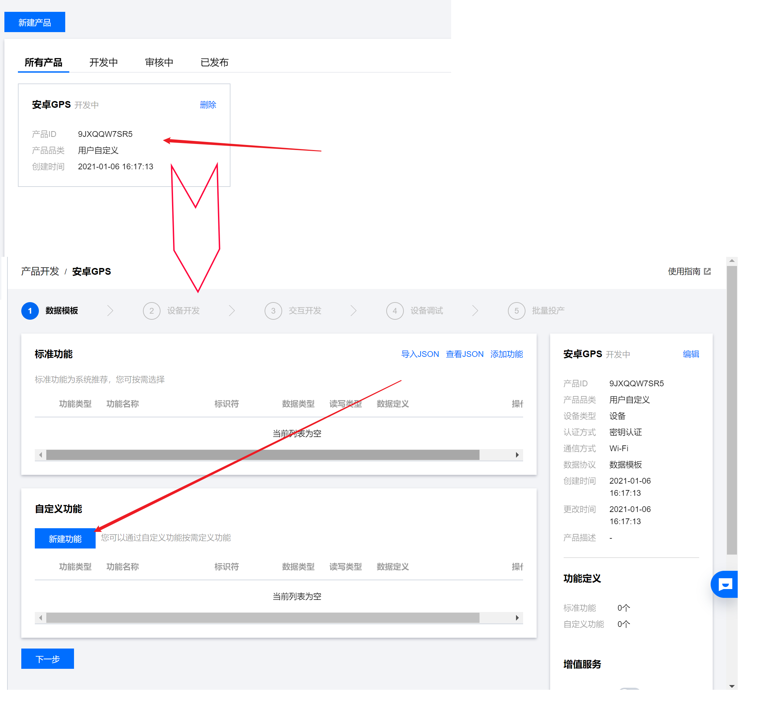

自定义功能我们只需要两个功能：

- 经度：position_x
- 纬度：position_y

建立经度如下，在功能类型中选择**属性**，数据类型我们选择浮点型。（经度和纬度的范围都在-180.0 ~180.0 ）

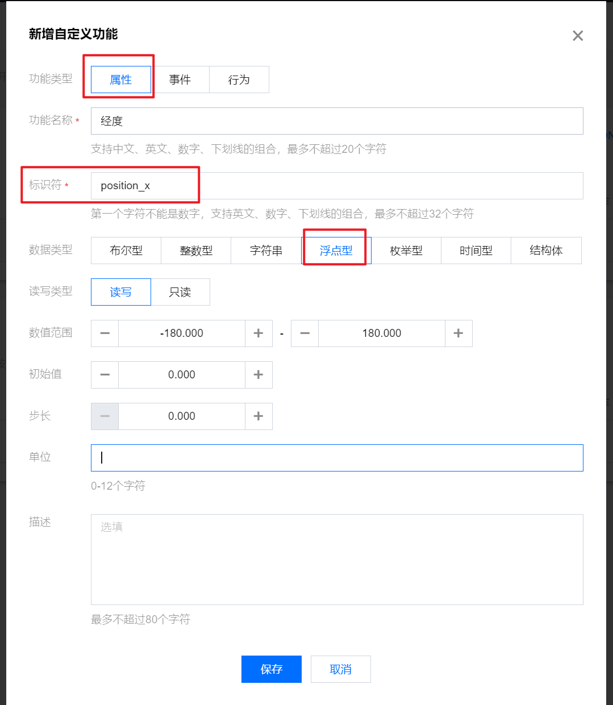

同理将纬度配置为`position_y`，功能类型为**属性**，数据类型同样为浮点型，范围为-180.0 ~180.0 。

关于功能类型的不同，可以参考下面的表格。

> 以下来自官方文档
>
> | 功能元素 | 功能描述                                                     | 功能标识符   |
> | :------- | :----------------------------------------------------------- | :----------- |
> | 属性     | 用于描述设备的实时状态，支持读取和设置，如模式、亮度、开关等。 | PropertiesId |
> | 事件     | 用于描述设备运行时的事件，包括告警、信息和故障等三种事件类型，可添加多个输出参数，如环境传感器检测到空气质量很差，空调异常告警等。 | EventId      |
> | 行为     | 用于描述复杂的业务逻辑,可添加多个调用参数和返回参数,用于让设备执行某项特定的任务，例如，开锁动作需要知道是哪个用户在什么时间开锁，锁的状态如何等。 | ActionId     |


点击下一步，进入设备开发。

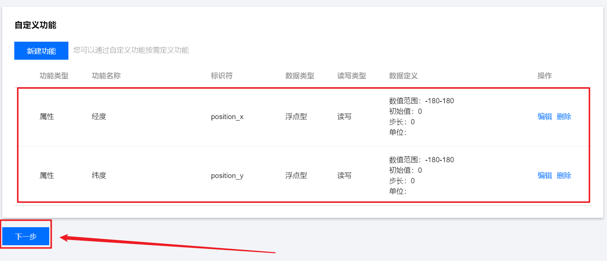


### 设备开发

因为我们使用的是Java SDK进行开发，没有使用模组也没有基于OS开发，因此直接点击下一步。

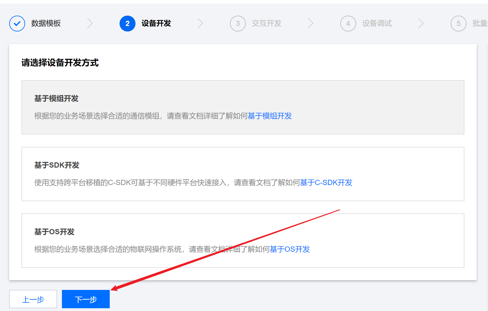

点击下一步就到了微信小程序配置。


### 微信小程序配置

腾讯IOT平台相比较于其他平台，有一个很大的特点就是可以很好的支持小程序。也就是说，在开发的阶段，就可以使用小程序去验证设备的功能。并且这个微信小程序不需要自己写样式代码，只需要进行简单的配置，就可以直接从小程序上面看到物联网设备的数据。

因为这里我们使用的数据很简单，只有经度和纬度两个数据，所以随便配置一下面板即可。

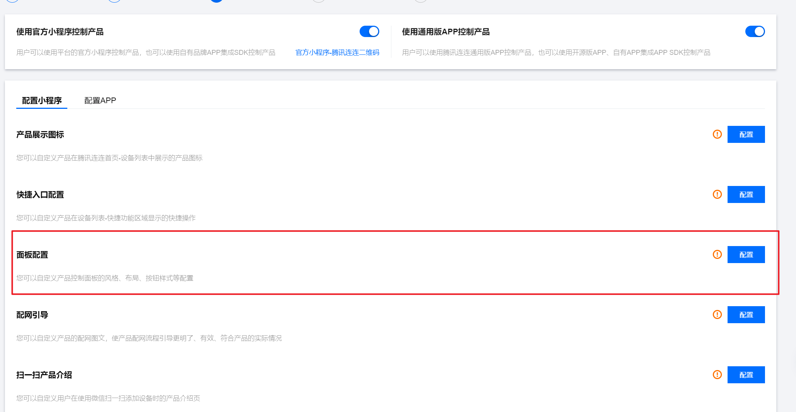


#### 面板配置

这里面板类型选择**标准面板**，然后配置一下模板样式（配置长按钮稍微好看一点），配置完效果图如右边所示。

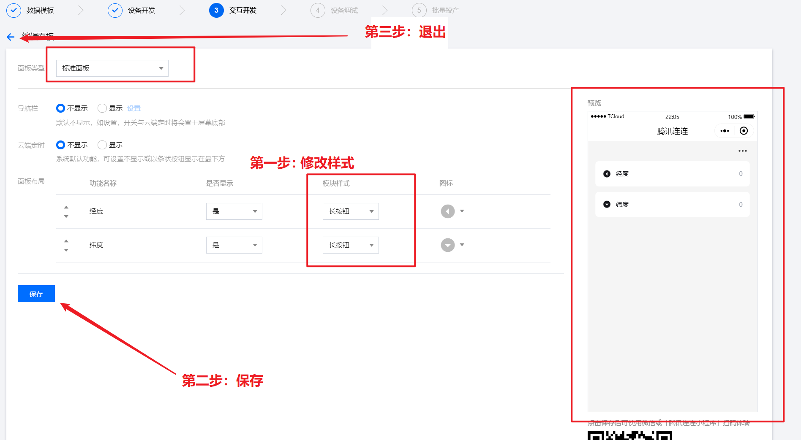


### 新建设备

>  新建设备`的意义：创建一个设备代表启动了一个账号（这个设备会提供一个密钥），我们的设备使用这个密钥，就可以让我们的设备连接腾讯云IOT平台进行数据交互。

新建设备的步骤如下所示：

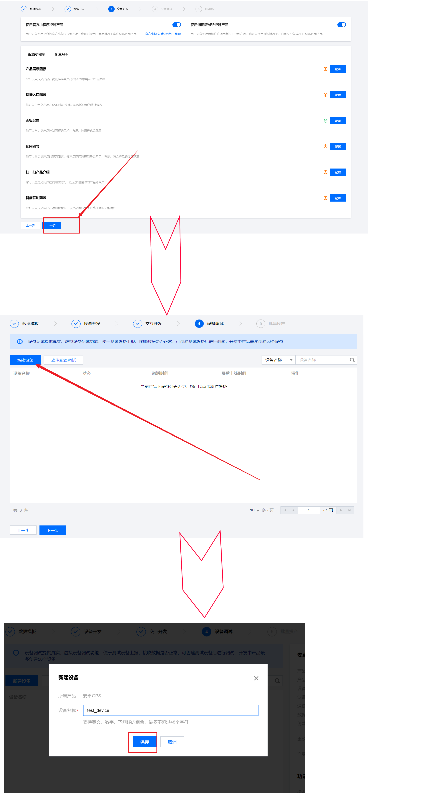

### 使用设备

点击test_device，进入设备管理。

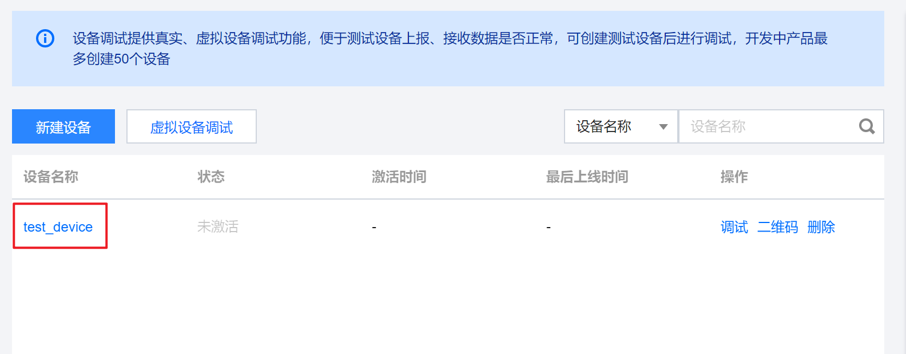

设备管理界面如下所示：

- 设备信息：这里面是设备的一些基本属性，其中通过设备``名称``，`设备密钥`，和`产品ID`就可以唯一定位一个`设备`，然后对其进行操作。

- 设备日志：设备日志里面保存着设备的上行和下行数据。
- 在线调试：通过在线调试，我们可以模拟设备的行为，或者对设备下发命令。

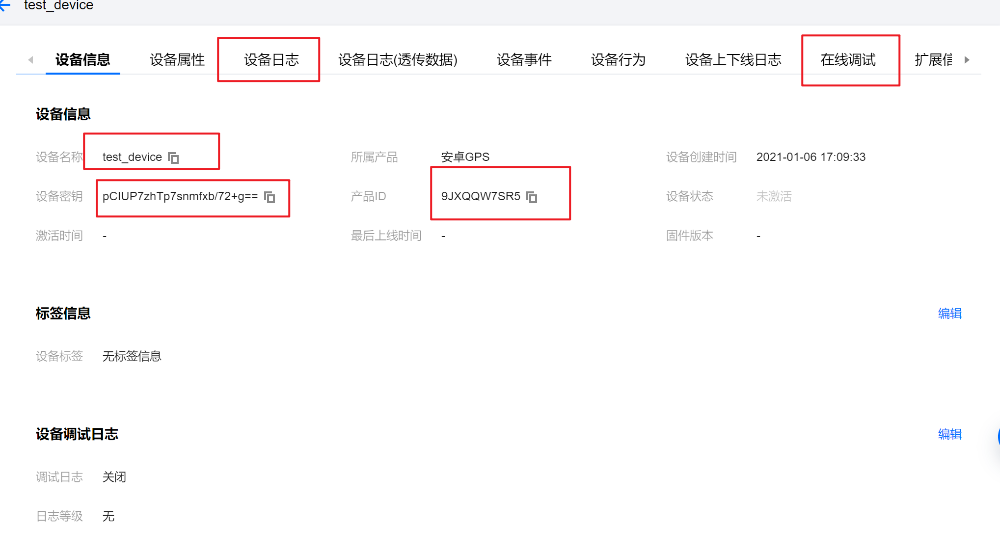


🆗，以上的所有就是腾讯IOT平台的介绍，通过上面的操作，就可以创建一个设备，获得其name，key，id，然后对其进行开发了。

## 安卓开发

安卓开发实现的效果很简单，就是实现一个页面展示经纬度，然后将经纬度数据上传到腾讯IOT平台就行。


### 前置配置

安卓开发，创建一个Android Studio项目，然后在APP的build gradle 中加入腾讯IOT的SDK

> ```java
> implementation 'com.tencent.iot.explorer:explorer-device-android:3.2.0'
> ```

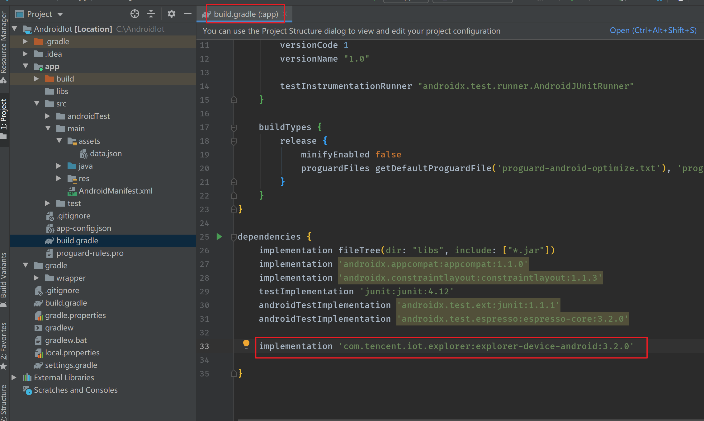

然后新建两个JSON文件（必做！！！！！），`data.json` ，代表的是设备的属性（这个文件的来源会在后面解释），然后是`app-config.json`，这个代表的是设备的配置（来源后文解释）。

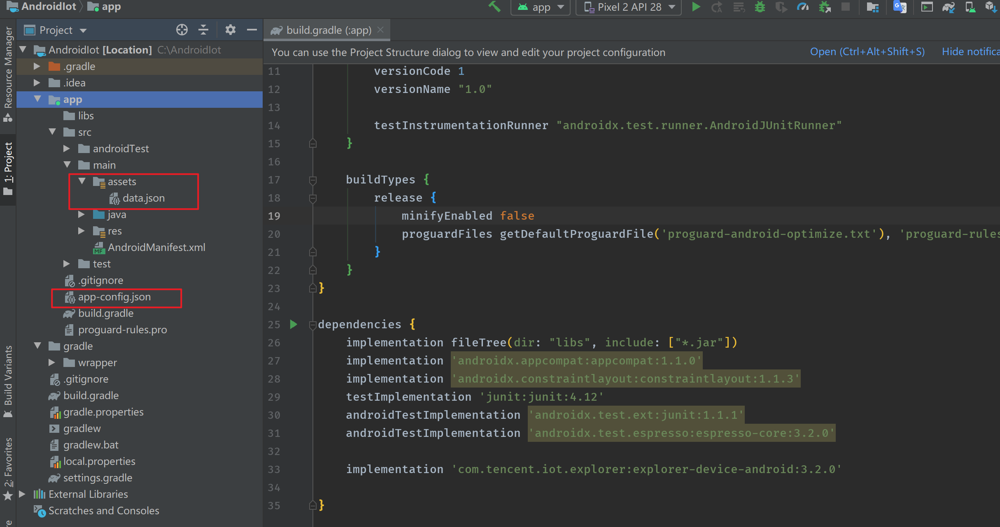

#### data.json

data.json 文件一定要放在安卓的assets目录下，安卓如何添加assets目录可以看[《Android studio 添加assets文件夹》](https://www.jianshu.com/p/c3cfd029d8b5)。data.json需要存放一些数据。这个数据实际上就是**自定义功能的数据**，复制之后粘贴到data.json文件中。

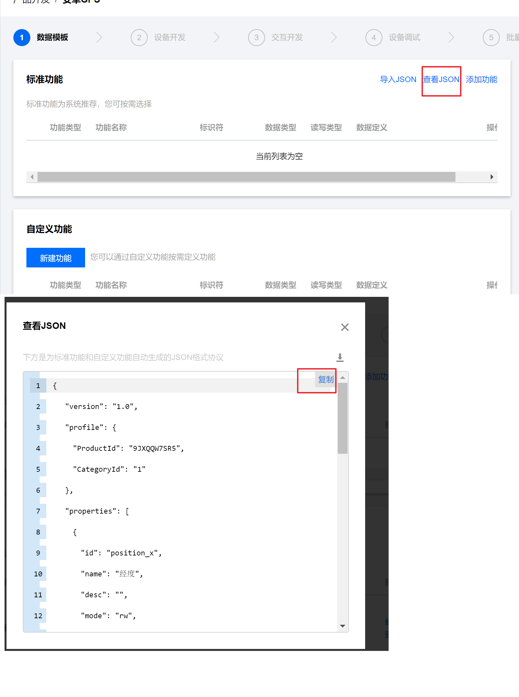


#### app-config.json

app-config.json文件的位置一定不要放错，它与src是同级目录，在app的下一级目录。

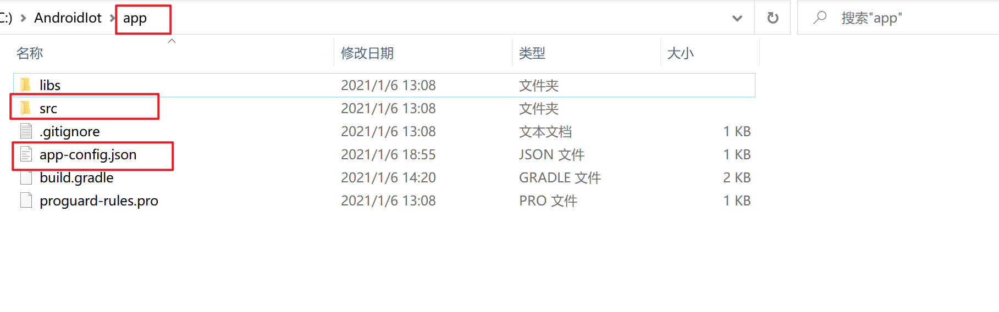

app-config里面是device的信息，数据内容如下：

```json
{
  "PRODUCT_ID":        "产品ID",
  "DEVICE_NAME":       "设备名称",
  "DEVICE_PSK":        "设备密钥",
  "SUB_PRODUCT_ID":    "",
  "SUB_DEV_NAME":      "",
  "SUB_DEV_PSK":       "",
  "SUB_PRODUCT_ID2":   "",
  "SUB_DEV_NAME2":     "",
  "SUB_DEV_PSK2":      ""
}
```

来源：

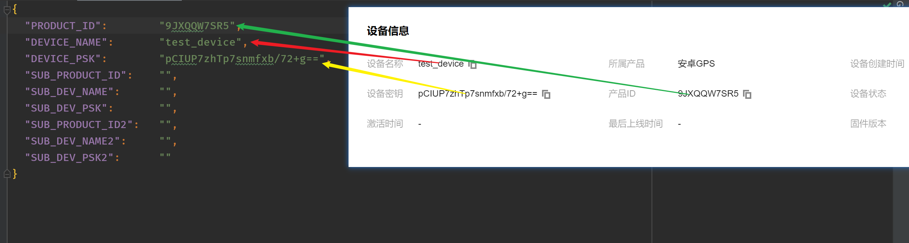

#### 权限配置

位置权限，和联网权限。在`AndroidManifest.xml`中添加如下权限。值得注意的是，位置权限在安卓版本比较高的设备中，需要使用代码申请位置权限。

```xml
    <!--    位置权限-->
    <uses-permission android:name="android.permission.ACCESS_FINE_LOCATION" />
    <uses-permission android:name="android.permission.ACCESS_COARSE_LOCATION" />
    <!--    联网权限-->
    <uses-permission android:name="android.permission.INTERNET" />
```


### 连接平台代码

通过官方提供的SDK，接入腾讯IOT平台实现设备连接和数据上传。代码如下所示，具体的含义写在注释中。在使用中，我们就可以通过实例化`IotCloudUtil`，然后使用`connect()`函数来实现连接和`propertyReport`函数来实现上传数据。

```java
package cc.weno.data_template;


import com.tencent.iot.explorer.device.android.common.Status;
import com.tencent.iot.explorer.device.android.data_template.TXDataTemplateClient;
import com.tencent.iot.explorer.device.android.data_template.TXDataTemplateDownStreamCallBack;
import com.tencent.iot.explorer.device.android.mqtt.TXMqttActionCallBack;
import com.tencent.iot.explorer.device.android.mqtt.TXMqttRequest;
import com.tencent.iot.explorer.device.android.utils.AsymcSslUtils;

import org.eclipse.paho.client.mqttv3.IMqttToken;
import org.eclipse.paho.client.mqttv3.MqttConnectOptions;
import org.eclipse.paho.client.mqttv3.MqttMessage;
import org.json.JSONObject;

import java.util.concurrent.atomic.AtomicInteger;

import cc.weno.location.MainActivity;


/**
 * 连接云平台的类
 *
 * @author XiaoHui
 */
public class IotCloudUtil {

    /**
     * 服务器网址
     */
    public static String mBrokerURL = "ssl://iotcloud-mqtt.gz.tencentdevices.com:8883";
    /**
     * 产品ID
     */
    public static String mProductID = "9JXQQW7SR5";
    /**
     * 设备名称
     */
    public static String mDevName = "test_device";
    /**
     * 设备密钥
     */
    public static String mDevPSK = "pCIUP7zhTp7snmfxb/72+g==";
    /**
     * data.json的名字
     */
    public static String mJsonFileName = "data.json";
    /**
     * MQTTAction的回调
     */
    private TXMqttActionCallBack mMqttActionCallBack = null;
    /**
     * 下行消息的回调
     */
    private TXDataTemplateDownStreamCallBack mDownStreamCallBack = null;

    /**
     * MQTT连接实例
     */
    private TXDataTemplateClient mMqttConnection;
    /**
     * Activity实例
     */
    private MainActivity context;

    /**
     * 请求ID
     */
    private static AtomicInteger requestID = new AtomicInteger(199);


    public IotCloudUtil(MainActivity context) {
        this.context = context;
        mDownStreamCallBack = new MyDownCallback();
        mMqttActionCallBack = new MyMQttCallBack();
    }

    /**
     * 建立MQTT连接
     */
    public void connect() {
        // 创建连接client
        mMqttConnection = new TXDataTemplateClient(context, mBrokerURL, mProductID, mDevName, mDevPSK,
                null, null, mMqttActionCallBack,
                mJsonFileName, mDownStreamCallBack);
        // 设置连接参数
        MqttConnectOptions options = new MqttConnectOptions();
        // 连接超时
        options.setConnectionTimeout(8);
        // 保持活跃的时间间隔
        options.setKeepAliveInterval(240);
        // 是否自动重连
        options.setAutomaticReconnect(true);
        // 因为我们是使用密钥登录，所以需要设置这个
        options.setSocketFactory(AsymcSslUtils.getSocketFactory());
        // 建立Request请求
        TXMqttRequest mqttRequest = new TXMqttRequest("connect", requestID.getAndIncrement());
        // 建立连接
        mMqttConnection.connect(options, mqttRequest);
    }

    /**
     * 断开MQTT连接
     */
    public void disconnect() {
        TXMqttRequest mqttRequest = new TXMqttRequest("disconnect", requestID.getAndIncrement());
        mMqttConnection.disConnect(mqttRequest);
    }

    /**
     * 发送消息
     *
     * @param property 消息内容
     * @param metadata 属性的metadata，目前只包含各个属性对应的时间戳，可以为NULL
     * @return 状态
     */
    public Status propertyReport(JSONObject property, JSONObject metadata) {
        return mMqttConnection.propertyReport(property, metadata);
    }


    /**
     * MQTT的回调函数，暂时不考虑
     */
    public static class MyMQttCallBack extends TXMqttActionCallBack {

        @Override
        public void onConnectCompleted(Status status, boolean reconnect, Object userContext, String msg) {

        }

        @Override
        public void onConnectionLost(Throwable cause) {

        }

        @Override
        public void onDisconnectCompleted(Status status, Object userContext, String msg) {
        }

        @Override
        public void onPublishCompleted(Status status, IMqttToken token, Object userContext, String errMsg) {
        }

        @Override
        public void onSubscribeCompleted(Status status, IMqttToken asyncActionToken, Object userContext, String errMsg) {

        }

        @Override
        public void onMessageReceived(final String topic, final MqttMessage message) {
        }
    }

    /**
     * 实现下行消息处理的回调接口，暂时不考虑
     */
    private static class MyDownCallback extends TXDataTemplateDownStreamCallBack {

        @Override
        public void onReplyCallBack(String msg) {
        }

        @Override
        public void onGetStatusReplyCallBack(JSONObject data) {

        }

        @Override
        public JSONObject onControlCallBack(JSONObject msg) {

            return null;
        }

        @Override
        public JSONObject onActionCallBack(String actionId, JSONObject params) {

            return null;
        }
    }

}

```

### 安卓页面配置

安卓页面很简单，就是展示经度和纬度的数据。

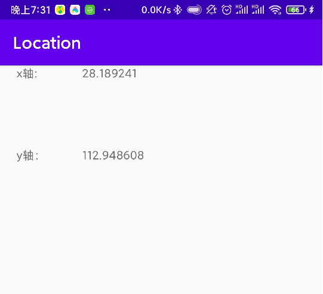

页面代码如下所示：

```xml
<?xml version="1.0" encoding="utf-8"?>
<RelativeLayout xmlns:android="http://schemas.android.com/apk/res/android"
    xmlns:tools="http://schemas.android.com/tools"
    android:layout_width="match_parent"
    android:layout_height="match_parent"
    tools:context=".MainActivity">

    <TextView
        android:layout_width="wrap_content"
        android:layout_height="wrap_content"
        android:layout_marginLeft="20dp"
        android:text="x轴:" />

    <TextView
        android:id="@+id/x_position"
        android:layout_width="wrap_content"
        android:layout_height="wrap_content"
        android:layout_marginLeft="100dp"
        android:text="0.00" />

    <TextView

        android:layout_width="wrap_content"
        android:layout_height="wrap_content"
        android:layout_marginLeft="20dp"
        android:layout_marginTop="100dp"
        android:text="y轴：" />

    <TextView

        android:id="@+id/y_position"
        android:layout_width="wrap_content"
        android:layout_height="wrap_content"
        android:layout_marginLeft="100dp"
        android:layout_marginTop="100dp"

        android:text="0.00" />

</RelativeLayout>
```


### Activity代码

在MainActivity，我们要实现如下的功能，申请位置权限，获得经纬度的数据，然后进行页面展示，最后将数据上传到云平台。

```java
package cc.weno.location;

import android.Manifest;
import android.location.Location;
import android.os.Bundle;
import android.widget.TextView;

import androidx.appcompat.app.AppCompatActivity;
import androidx.core.app.ActivityCompat;

import com.tencent.iot.explorer.device.android.common.Status;

import org.json.JSONException;
import org.json.JSONObject;

import cc.weno.data_template.IotCloudUtil;


/**
 * 主页面，进行展示以及发送数据
 *
 * @author XiaoHui
 */
public class MainActivity extends AppCompatActivity {
    /**
     * 展示经度
     */
    private TextView xPositionView;
    /**
     * 展示纬度
     */
    private TextView yPositionView;

    @Override
    protected void onCreate(Bundle savedInstanceState) {
        super.onCreate(savedInstanceState);
        setContentView(R.layout.activity_main);
        xPositionView = findViewById(R.id.x_position);
        yPositionView = findViewById(R.id.y_position);
        // 基本上现在的安卓机都需要申请位置权限了
        ActivityCompat.requestPermissions(this, new String[]{Manifest.permission.ACCESS_FINE_LOCATION}, 1);
        // 获得位置数据并且发送数据到云平台
        getAndSendLocation();
    }

    private void getAndSendLocation() {
        // 获得GPS工具类
        GPSUtils gpsUtil = GPSUtils.getInstance(this);
        // 获得位置
        Location location = gpsUtil.getLocation();

        double positionX = location.getLatitude();
        double positionY = location.getLongitude();
        // 在手机页面上展示
        xPositionView.setText(String.valueOf(positionX));
        yPositionView.setText(String.valueOf(positionY));
        // IotCloudUtil
        IotCloudUtil iotCloudUtil = new IotCloudUtil(this);
        // 连接云平台
        iotCloudUtil.connect();

        // 等待几秒钟，连接成功
        try {
            Thread.sleep(4000);
        } catch (InterruptedException e) {
            e.printStackTrace();
        }
        // 调用发送数据的函数需要传入JsonObject类型的数据
        JSONObject property = new JSONObject();
        try {
            property.put("position_x", (float) positionX);
            property.put("position_y", (float) positionY);
            // 发送数据
            Status status = iotCloudUtil.propertyReport(property, null);
            if (status == Status.OK){
                // 发送成功
            }
        } catch (JSONException e) {
            e.printStackTrace();
        }
    }

```

其中GPS工具就不进行介绍了，因为其不是重点，关于具体的代码可以参考[GitHub](https://github.com/xiaohuiduan/android_test_iot_for_tecent)。


## 微信小程序使用

前面我们说了，可以是用微信小程序对开发的物联网设备进行开发调试，然后我们在如下的页面得到设备的二维码。

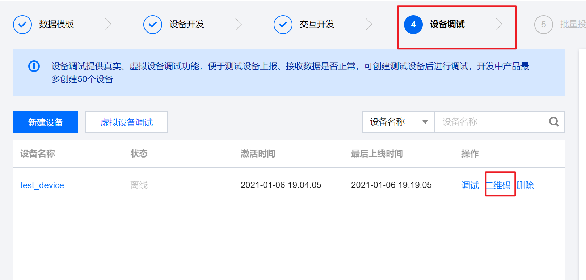

然后打开”腾讯连连“小程序，对二维码进行扫描，即可将设备加入。

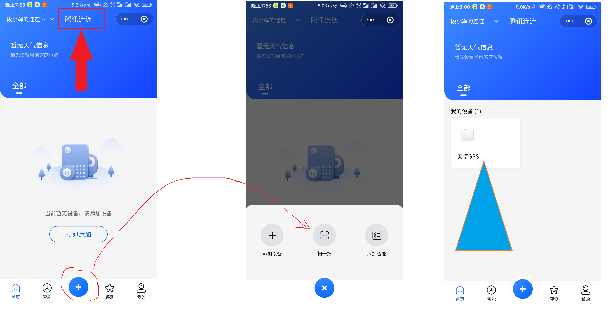


然后我们运行安卓程序，自动向腾讯IOT平台发送经纬度数据，然后在微信小程序上就可以看到最新的数据。

中间存在些许误差，可能是因为double转float的精度原因导致的。

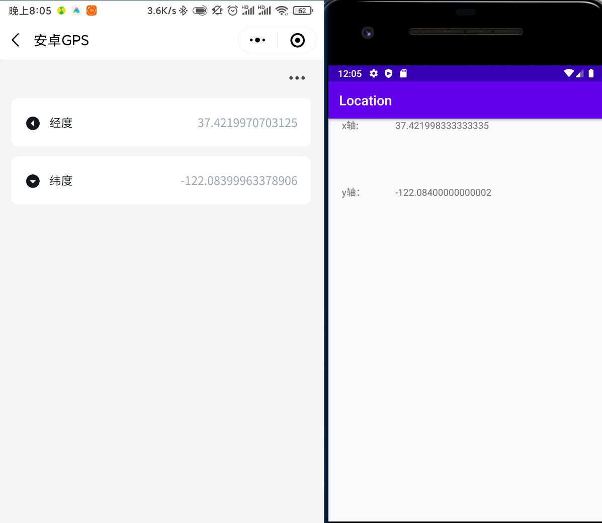


## 总结

通过上面的操作我们创建了一个安卓程序，然后能够在微信小程序上面看到安卓设备的经纬度。归咎于原理，就是MQTT协议。使用平台提供的SDK，让开发者省下了大量花费在通信协议上面的时间。然而，我们还是应该去关注MQTT协议本身。知其然，更要知其所以然。

### 参考

1. Github：[android_test_iot_for_tecent](https://github.com/xiaohuiduan/android_test_iot_for_tecent)

2. 物联网开发平台使用文档：[物联网开发平台 - 文档中心 - 腾讯云 (tencent.com)](https://cloud.tencent.com/document/product/1081)
3. Github：[iot-device-java](https://github.com/tencentyun/iot-device-java)

